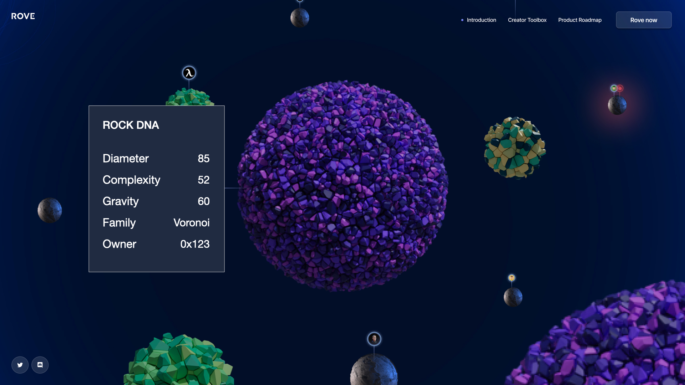

# Rocks

Rocks are where and how things happen in each [metaverse](../metaverses.md). Rocks are foundations for Rovers to build, host, and participate in [social](../../3d-experiences/experiences.md), gaming, commerce, work, and learning experiences.

Rocks have attributes common to their local metaverses – such as density, size, color, location, and gravity. These attributes shape how Rovers create and participate in experiences.

Rocks are NFTs within Rove.

## A bottom-up approach to NFT design

Typically, products employ a top-down approach. These products are designed for specific problems or purposes. We see this in many in-product NFTs. For example, a game could define various specific in-game NFTs for its players.

Rove takes a bottom-up approach. Rocks are general-purpose NFTs. They are not tied to a single experience, product, or game. They are foundations for Rovers to build different experiences on top of.

.png>)

Think of Rock attributes as basic primitives that can be used in infinite ways – like a deck of cards. Creators can interpret these attributes however they like to build unique and engaging experiences – like Blackjack or Poker.

.png>)
